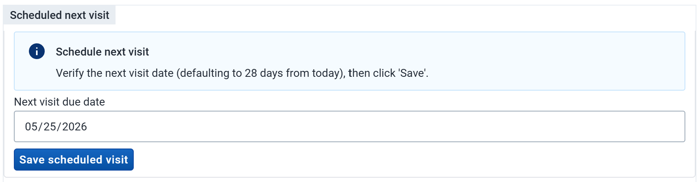
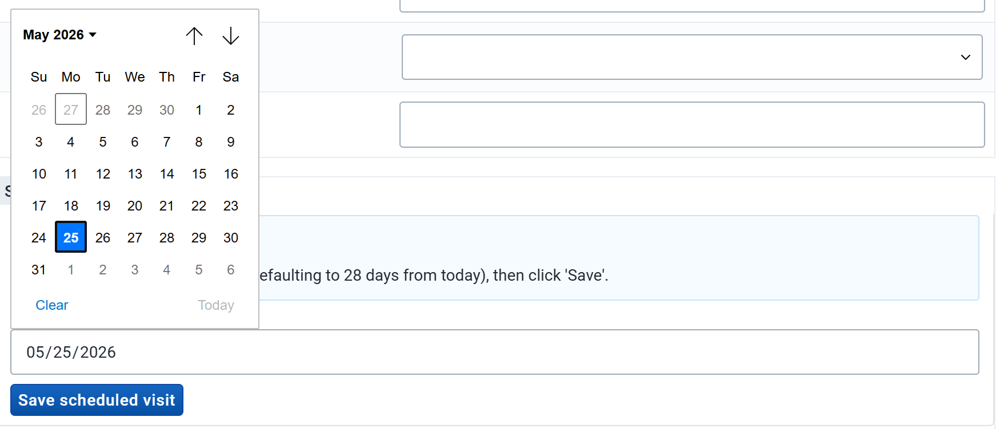
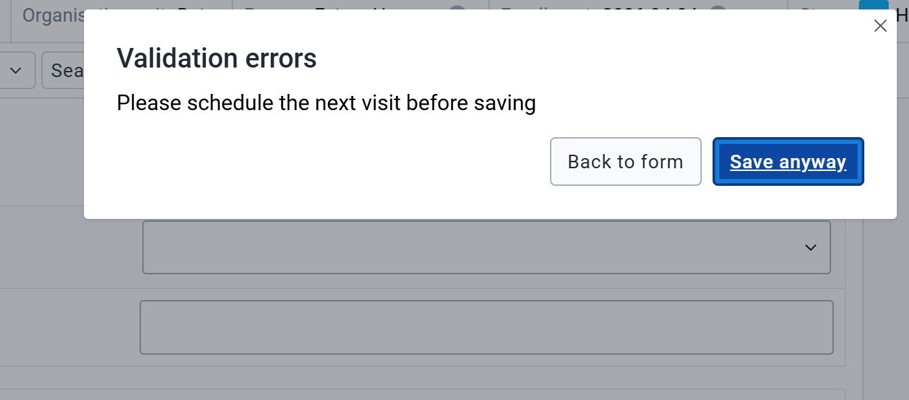
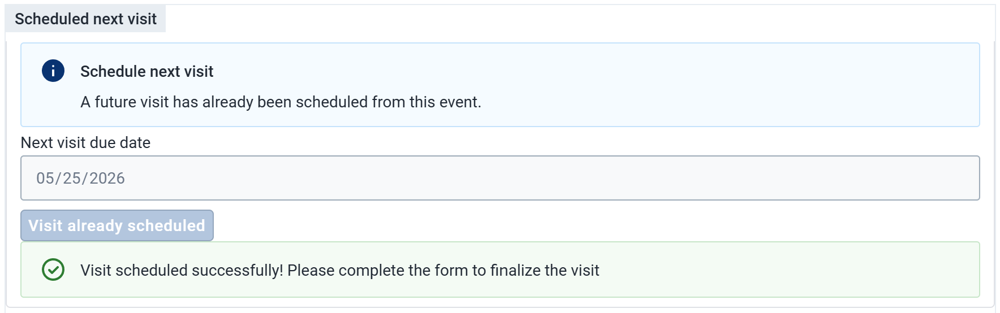

# DHIS2 In-Form Visit Scheduler Plugin

## Overview

The In-Form Visit Scheduler is a custom DHIS2 Capture App plugin designed to streamline patient workflows by allowing health workers to schedule a patient's next visit directly from within the current visit (event) data entry form.

The primary goal of this plugin is to **force the creation of an appointment** before the health worker is allowed to complete the current visit form.

**Key Features & Behaviors:**

* **Seamless Integration:** Works perfectly during the very first visit (when the program stage is set to repeatable, *Auto-generate event* is enabled, and *Open data entry form after enrollment* is checked) as well as for any subsequent visits triggered from the Capture enrollment dashboard.
* **Duplicate Prevention:** Uses an internal Data Element (visible but locked as read-only) to track successful scheduling. Once scheduled, the plugin's action button is immediately disabled to prevent users from creating multiple overlapping appointments.
* **Native Modification:** The plugin strictly handles the *creation* of the appointment. Any subsequent modifications to the scheduled date must be done natively from the Capture enrollment dashboard.

---

## Installation & Configuration Guide

### 1. Deploy the Plugin

1. Clone this repository.
2. From the project folder, run `yarn build`.
3. Open the DHIS2 **App Hub** (or App Management app).
4. Select **Manual install**.
5. Choose the generated `.zip` file under `./build/bundle` to deploy the plugin to your server.

### 2. Map the Data Element (Tracker Configurator)

The plugin relies on a "Yes only" Data Element to track the scheduling state.

1. Create a Data Element (e.g., `Scheduling done`) with **Value Type:** `Yes Only` and **Domain:** `Tracker`.
2. **Crucial Step:** Assign this Data Element to your Program Stage, and **add it to a Program Stage Section (form layout)**. It must be physically visible on the form for the DHIS2 engine to function correctly.
3. Open the **Tracker Configurator** app.
4. Choose **Form Field Plugins** and click on "Add Configuration". Select your program and program stage where you want to have the scheduler.
5. Select **Add Element** and find the scheduler plugin on the list.

6. Place the scheduling plugin in your desired position on the form (ideally right next to the Data Element).
7. In the Attributes/Data Elements mapping section for the plugin, map your Data Element to the exact alias: `schedulingDone`.

### 3. Configure the Program Rules

To strictly enforce scheduling before form completion and to lock the native checkbox, you must configure three distinct Program Rules.

#### Why the Data Element must be visible and locked

The DHIS2 Capture form engine utilizes an aggressive "Garbage Collector" to prevent ghost data. If a Data Element is hidden from the layout, DHIS2 will silently erase its value from the payload the moment a user edits any historical data. By making the field **visible**, we force the engine to preserve our scheduling flag.
However, making it visible means users could click it manually and bypass the plugin entirely! To fix this, we use the DHIS2 "Assign Value" Program Rule Action to lock the checkbox (making it Read-Only to the user), while allowing the plugin to securely update it in the background.

**A. Create the Program Rule Variable (PRV)**

* **Program:** Your target program (e.g., Hypertension & Diabetes)
* **Name:** `schedulingDone`
* **Source type:** Data element in current event
* **Data element:** `Scheduling done`

**B. The Enforcer Rule: Block Completion**
This rule blocks the user from clicking the native Complete button until the plugin runs.

* **Name:** `SHOWERROR if visit not scheduled`
* **Condition:** `(!d2:hasValue(#{schedulingDone}) || #{schedulingDone} != true)`
* **Action:** Show error on complete
* **Static text:** `Please schedule the next visit before saving.`

**C. The Initial Lock Rule: Freeze the Checkbox**
This rule triggers immediately when the form loads, assigning an empty string to the checkbox to prevent users from checking it manually.

* **Name:** `LOCK Scheduling Checkbox`
* **Condition:** `!d2:hasValue(#{schedulingDone})`
* **Action:** Assign value
* **Data element to assign:** `Scheduling done`
* **Expression to evaluate:** `''`

**D. The Final Lock Rule: Secure the Checkbox**
Once the plugin successfully API schedules the visit and sets the value to `true`, this rule takes over, locking the checkbox in the checked state so the user cannot uncheck it.

* **Name:** `LOCK Scheduling Checkbox when true`
* **Condition:** `d2:hasValue(#{schedulingDone}) && #{schedulingDone} == true`
* **Action:** Assign value
* **Data element to assign:** `Scheduling done`
* **Expression to evaluate:** `true`

> **Note on JSON Metadata Import:** > While the metadata (DE, PRV, PR, PRA) can be automatically created by importing the `metadata.json` configuration file (see [`./metadata/metadata.json`](https://www.google.com/search?q=./metadata/metadata.json)), you must:
> 1. Verify and remap the Program Rule Variable and Program Rules to the corresponding **Program** in your instance.
> 2. Manually assign the Data Element to the correct **Program Stage** and **Form Section**.
> 
> 

---

## User Workflow

### 1. Default Predefined Date

When the user opens the form, the plugin automatically pre-calculates the recommended next visit date. By default, this is set to **28 days** in the future from the current day (this interval can be modified via a variable in the plugin's source code).

### 2. Amending the Date
If the health worker needs to adjust the predefined date (e.g., the default date falls on a weekend or public holiday), they can click anywhere on the date field to open the native calendar and select a new date.

### 3. Error on Premature Completion

If the user ignores the plugin and attempts to click the native DHIS2 "Complete" button before scheduling the next visit, the Program Rule will trigger, blocking the save and displaying an error message.

### 4. Successful Scheduling

Once the user verifies the date and clicks **Save scheduled visit**, the plugin communicates with the DHIS2 server to create the future event.
Upon success:

* A green success message is displayed.
* The Data Element is marked as `true` in the background (and visually ticks the native locked checkbox below it).
* The "Save" button is permanently disabled for this session to prevent duplicate appointment creation.
* The user can now safely complete the native DHIS2 form.

