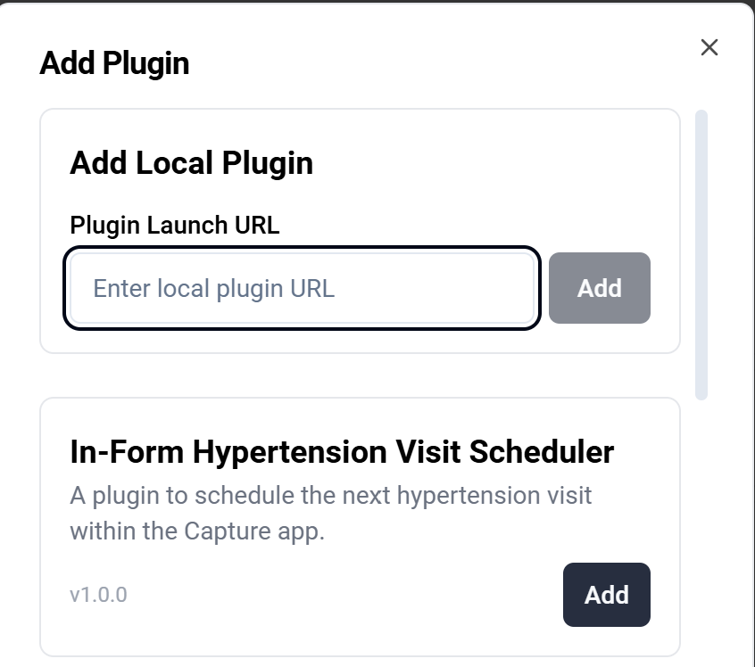
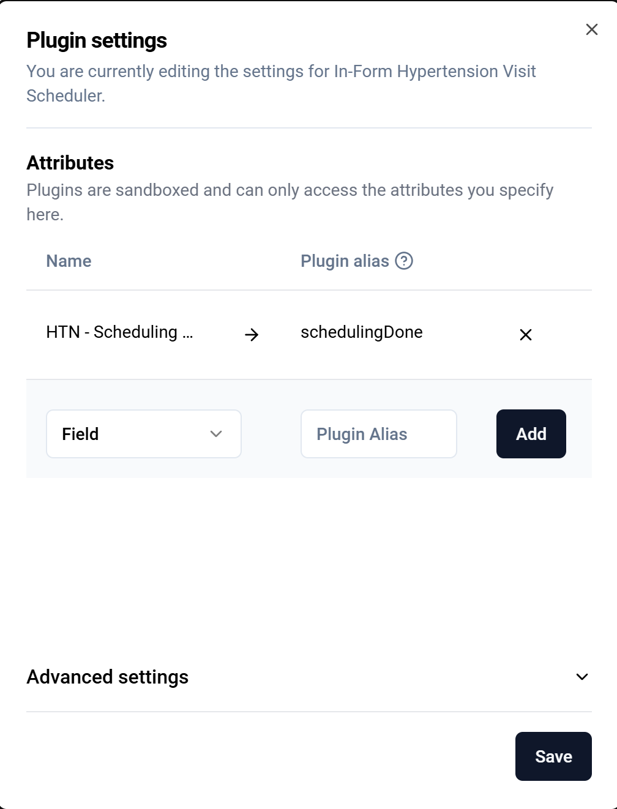

# DHIS2 In-Form Visit Scheduler Plugin

## Overview
The In-Form Visit Scheduler is a custom DHIS2 Capture App plugin designed to streamline patient workflows by allowing health workers to schedule a patient's next visit directly from within the current visit (event) data entry form. 

The primary goal of this plugin is to **force the creation of an appointment** before the health worker is allowed to complete the current visit form.

**Key Features & Behaviors:**
* **Seamless Integration:** Works perfectly during the very first visit (when the program stage is set to repeatable, *Auto-generate event* is enabled, and *Open data entry form after enrollment* is checked) as well as for any subsequent visits triggered from the Capture enrollment dashboard.
* **Duplicate Prevention:** Uses an internal Data Element (hidden in the form) to track successful scheduling. Once scheduled, the plugin's action button is immediately disabled to prevent users from creating multiple overlapping appointments.
* **Native Modification:** The plugin strictly handles the *creation* of the appointment. Any subsequent modifications to the scheduled date must be done natively from the Capture enrollment dashboard.

---

## Installation & Configuration Guide

### 1. Deploy the Plugin
1. Clone this repository
2. From the project folder, run **yarn build** 
3. Open the DHIS2 **App Hub** (or App Management app).
4. Select **Manual install**.
5. Choose the generated under `.zip` file under ./plugin-folder/build/bundle to deploy the plugin to your server.

### 2. Map the Data Element (Tracker Configurator)
The plugin relies on a "Yes only" Data Element to track the scheduling state. 
1. Create a Data Element (e.g., `Scheduling done`) with **Value Type:** `Yes Only` and **Domain:** `Tracker`.
2. Assign this Data Element to your Program Stage, but do not assign it to any program stage section (form), so it remains **hidden** in Capture during data entry.
3. Open the **Tracker Configurator** app.
4. Choose **Form Field Plugins** and click on "Add Configuration". Select your program and program stage where you want to have the scheduler.
5. Select **Add Element** and find the scheduler plugin on the list.

4. Place the scheduling plugin in your desired position on the form.
5. In the Attributes/Data Elements mapping section for the plugin, map your Data Element to the exact alias: `schedulingDone`.

### 3. Configure the Program Rules
To strictly enforce scheduling before form completion, you must configure a Program Rule that reads the plugin's Data Element.

**A. Create the Program Rule Variable (PRV)**
* **Program:** Your target program (e.g., Hypertension & Diabetes)
* **Name:** `schedulingDone`
* **Source type:** Data element in current event
* **Data element:** `Scheduling done`

**B. Create the Program Rule (PR)**
* **Name:** `SHOWERROR if visit not scheduled`
* **Program:** Your target program
* **Program Rule Expression:** `!d2:hasValue(#{schedulingDone}) || #{schedulingDone} != true`

**C. Create the Program Rule Action (PRA)**
* **Action:** Show error on complete
* **Data element:** (Leave blank or select the date field if preferred)
* **Static text:** `Please schedule the next visit before saving.`

> **Note on JSON Metadata Import:** > While the metadata (DE, PRV, PR, PRA) can be automatically created by importing the `metadata.json` configuration file (see [`./metadata/metadata.json`](./metadata/metadata.json)), you must:
> 1. Verify and remap the Program Rule Variable and Program Rule to the corresponding **Program** in your instance.
> 2. Manually assing the Data Element to the correct **Program Stage**.

---

## User Workflow

### 1. Default Predefined Date
When the user opens the form, the plugin automatically pre-calculates the recommended next visit date. By default, this is set to **28 days** in the future from the current day (this interval can be modified via a variable in the plugin's source code).

### 2. Amending the Date
If the health worker needs to adjust the predefined date (e.g., the default date falls on a weekend or public holiday), they can click anywhere on the date field to open the native calendar and select a new date.

### 3. Error on Premature Completion
If the user ignores the plugin and attempts to click the native DHIS2 "Complete" button before scheduling the next visit, the Program Rule will trigger, blocking the save and displaying an error message.

### 4. Successful Scheduling
Once the user verifies the date and clicks **Save scheduled visit**, the plugin communicates with the DHIS2 server to create the future event. 
Upon success:
* A green success message is displayed.
* The Data Element is marked as `true` in the background.
* The "Save" button is permanently disabled for this session to prevent duplicate appointment creation. 
* The user can now safely complete the native DHIS2 form.

